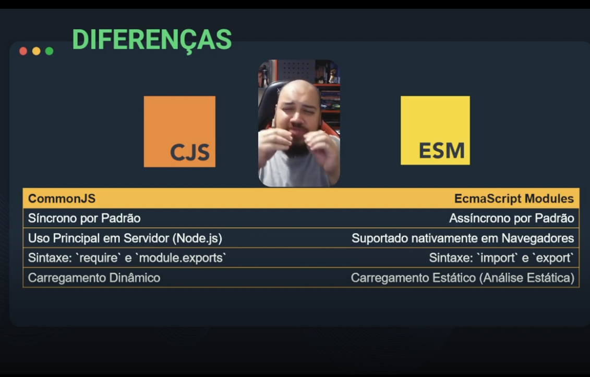
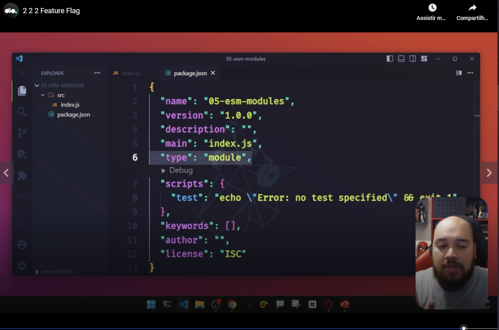
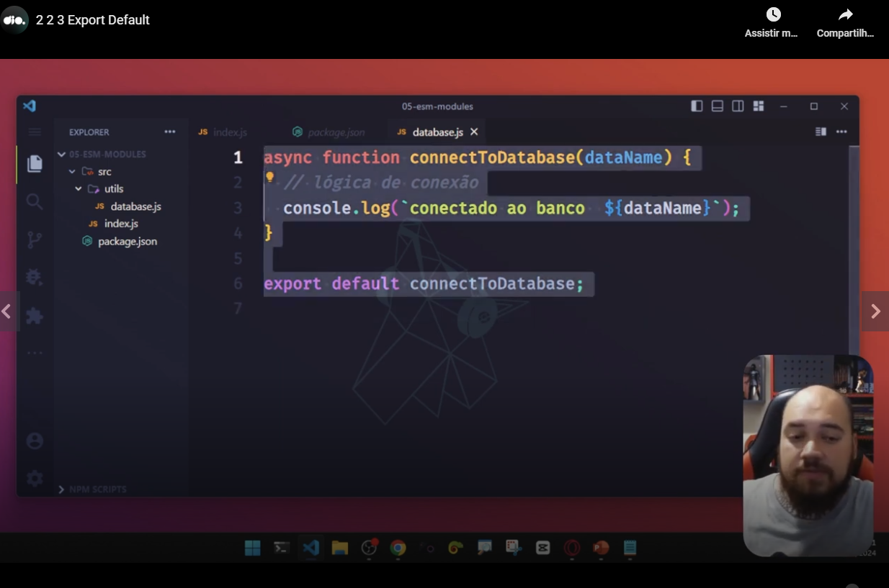
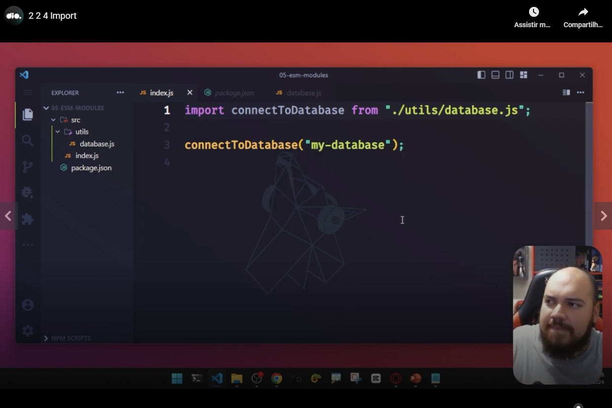
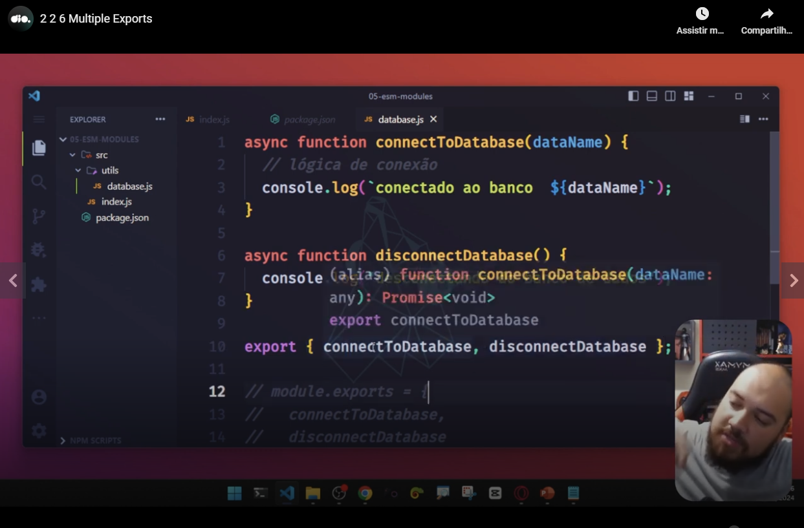
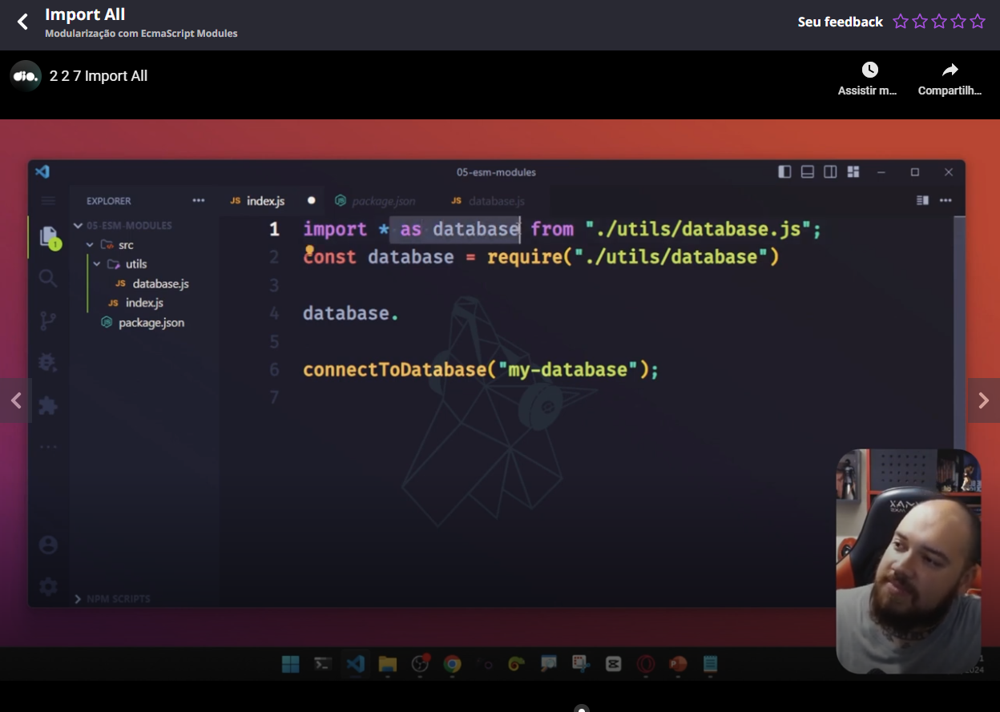
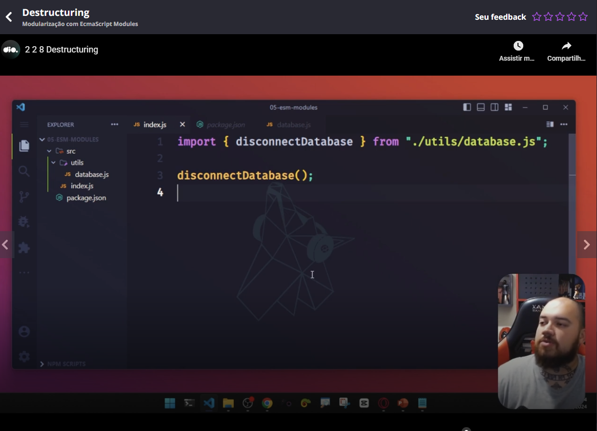

# Initial comparison: ESM x CJS modules

# Talking a little about the past

Teacher explained that in the past we had different browsers implementing different ways to do the same thing and Brendan Eich and Ecma made a standard to do several things. They generated standards as example ECMAScript 6 (or 2015). They recommend the use od ECMA Script modules and teacher also made this recommendation, enforcing that you also will see several libraries using this type of modularization.

# Using ESM modules

You can use through the root node type of the package.json:

A comment: the default value of this node is "commonjs".

# Export default of ESM modules

# Importing ESM modules

**An important observation**: in this way to import a module, you **must** specify the extension of the file.

A comment: you can use a module file with the extension **.mjs**. This way make more sense to specify the extension of the file. This type of the file was projected to store only JavaScript functions to be exported. You can choose in this case to use the extension **.js** or **.mjs**.

# Exporting several things (using ESM modules)

# Importing several things (using ESM modules)

You can import several things using "*".

# Importing only one thing if several was exported - destructuring

# Importing * using an alias

# Direct export

# Slides of the class

[link](https://hermes.dio.me/files/assets/0d9f3b1d-ad86-44e8-927a-4322c486e910.pptx)
